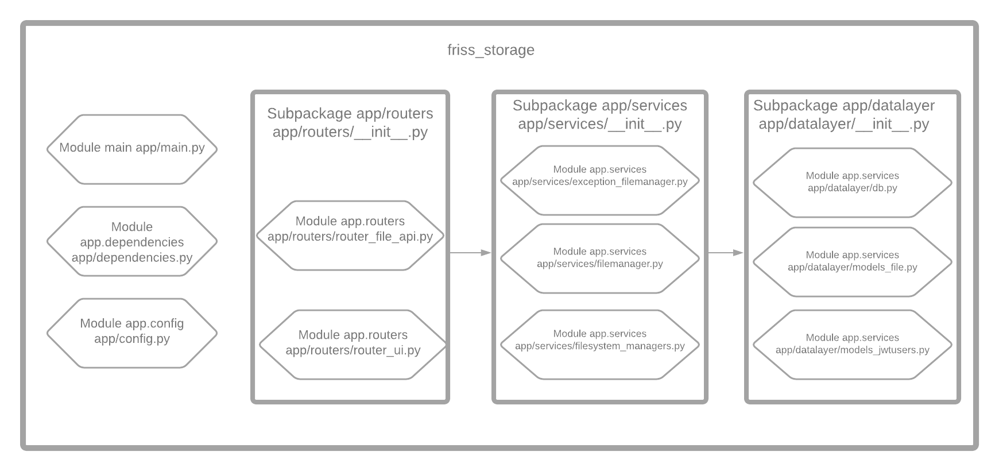

# Friss Storage
An API based project to upload/download files

## File Structure:


## Preconditions:
- Python 3
- Running local (without Docker): MySQL 5.7 CE (up and running)
*NOTE*: Default config.py is trying to connect at DB 127.0.0.1
user root without password 

## Clone the project
```
git clone [git@github.com:richardf1981/friss_storage.git|https://github.com/richardf1981/friss_storage.git]
```

### Install dependencies
*NOTE*: If any error received during install of mysqlclient
maybe export PATH is necessary, i.e.:  
export PATH=$PATH:/usr/local/mysql/bin
```
pip install -r requirements.txt
```

## Run local

### User for Basic Auth & JWT
For JWT its possible to freely create please go to 
/docs and press "try it out". Anyway a default user 
will be provided

### Install dependencies

```
pip install -r requirements.txt
```

### Run server

```
uvicorn app.main:app --reload
```

### Run unit tests

```
python -m unittest discover -s app/tests/unit
```

### Run integrated tests

```
python -m unittest discover -s app/tests/integrated
```

## Run with docker

### Build & Run server
```
docker-compose up -d --build
```


## API documentation (provided by Swagger UI)

```
http://127.0.0.1:8000/docs
```


### UI version
To see UI version please try this link
[http://localhost:8000](http://localhost).

## Tasks
[ x ] API authenticated JWT <br>
[ x ] Storing data in database <br>
[ x ] Flexibility for changing Saving handling <br>
[ x ] Rest API <br>
[ x ] SPA for using API <br> 
[ &nbsp; &nbsp;] Server side caching <br>
[ x ] Dockerfile <br>
[ x ] Logging for HTTP incoming requests <br>
[ x ] Verify setup (local) <br>
[ x ] Readme file <br>
[ x ] Unit tests <br>
[ &nbsp; ] Integrated tests <br>
[ &nbsp; ] Concurrency tests using services <br>
[ X ] Change DB Mechanism <br>
[ x ] Flake8: Pep8 Analyses + Manual review <br>
[ &nbsp; ] Refactor UI code in JS <br>
[ &nbsp; ] Re-style UI <br>
[ x ] Listing files available for download <br>
[ &nbsp; ] Handle JWT properly in JS client

## Over Delivering
[ x ] APIs for user management JWT <br>
[   ] Running version in my own private Cloud
